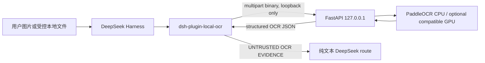

# 架构与信任边界

## 数据流

插件与 OCR 服务是两个独立进程。服务没有 Harness、session 或文件系统路径概念，只接收上传的
图片字节；插件负责授权来源、读取字节、调用回环 HTTP、格式化结果以及把错误转成模型可理解的
消息。

V2 将部署职责交给独立的 `dsh-local-ocr-runtime` npm 包。Runtime 管理专用 Python venv、锁定的
Paddle 依赖、模型同意记录、模型缓存、服务日志和自有 PID；`start` 只绑定回环地址并在 warmup
成功后报告可用，`stop` 会校验记录的进程命令行后才终止。Runtime 状态不会写入仓库。

PaddleOCR 公开模型文件是服务的独立本地资产，使用 `OCR_MODEL_CACHE_DIR` 配置；当前 PaddleX
3.7 将它们存放在 `D:\Program Files\local model\paddleocr\official_models`，与用户已有的其他
本地模型隔离。该目录只在 PaddleOCR 首次初始化时写入，图片或 OCR 结果不会写入其中。

## 附件路径

普通文本 provider route 会被官方 Host 的图片准入检查拒绝。local OCR bundle 注册一个独立的
`deepseek-local-ocr` route，但**不设置默认模型**。用户必须在 Harness 模型选择器中主动选择该 route
下的模型；bridge 会动态发现所有已注册 upstream provider，并把 `provider + model` 编码进 bridge 模型 ID，
因此官方、OpenCode Go 和其他来源的同名模型不会冲突。启动脚本只为该 profile 隔离 settings 文件，不会替用户选择模型。
选中的 bridge 模型执行以下流程：

1. Host 按官方附件策略校验并把图片存入 `$DSH_HOME/attachments/v1`。
2. 桥接 adapter 解码用户选择的真实上游 route，并把发往上游模型的 `ImageBlock` 替换成附件 ID 提示，不读取或发送图片字节。
3. 模型用该 ID 调用 `vision_read` 或 `vision_read_region`。
4. 工具在 `exec.agent.session` 的消息/事件中查找同一 ID；任意伪造 ID 都会被拒绝。
5. `ctx.attachments.readImage(ref, exec.signal)` 校验内容摘要和元数据后返回本地字节。
6. 插件再次检查格式、文件头、大小和尺寸，然后上传至 `127.0.0.1`。

桥接 adapter 只做图片到句柄的降级和 provider 委派，不执行 OCR，也不把图片伪装成上游模型
可直接理解的内容。`deepseek-local-ocr` 不是某个官方套餐或 OpenCode Go 模型；实际文本请求仍由
用户选择的 provider 处理。Harness 可能按自身标准保存用户最后选择的默认模型，但插件不会强制
把默认值改成 bridge 或某个具体模型。

## 本地文件路径

本地文件输入**默认禁用**。bundle 的 `allowedDirectories` 默认是空数组；即使 session 有 workspace，
也不会因此自动授予 `file_path` 读取权限。部署者必须在 Harness profile 的插件配置中显式列出最小的
允许根目录，工具才会通过 `ctx.fs` 解析 session workspace 中的路径，并执行 realpath-aware
containment，再以最大字节数读取。
OCR 服务永远不会接收 `file_path`，所以即使服务接口被误用，也不能让它自行读取任意本地文件。

附件和允许目录中的文件都会在上传前检查文件大小、扩展名、声明 MIME、magic bytes、图片头部尺寸和
像素上限。服务的请求中间件还会在 multipart 解析前限制 `Content-Length` 和流式请求体；随后才检查
扩展名、MIME、magic bytes 和 Pillow 完整解码结果的一致性。允许格式固定为 PNG、JPEG、WebP。
单文件默认上限 15 MiB，最大边长 12,000 px，默认总像素上限 40,000,000。

## 信任边界

| 边界 | 信任判断 | 控制 |
| --- | --- | --- |
| 用户 / 图片 | 不可信 | 类型、尺寸、像素、摘要、目录与 session 引用校验 |
| OCR 文字 / 模型 | 不可信外部证据 | 所有输出模式带固定警示；可选问题与 OCR 内容分隔 |
| 插件 / OCR 服务 | 本机进程边界 | 仅 `http://127.0.0.1`、可选 Bearer Token、超时、响应大小上限 |
| OCR 服务 / 文件系统 | 无权限语义 | API 只接受 multipart bytes，不接受路径或 URL |
| OCR 服务 / 网络 | 默认无出站需求 | Paddle 模型首次安装/下载除外；推理期不调用云视觉 API |
| Harness / DeepSeek | 正常模型边界 | 图片字节不发送；OCR 文字作为工具结果进入当前模型上下文 |

最后一项很重要：本项目保证 OCR 推理和图片处理在本机完成，但工具输出必须让文本模型读取。
如果 Harness 的当前模型提供方是云端 DeepSeek，识别出的文字会随正常模型请求发送给该提供方；
需要文字也不离机时，应在模型选择器中选择已配置的本地文本模型来源，并通过对应的 bridge 模型 route 发送。

## 并发、取消与错误

- 插件限制同时进行的 HTTP 调用；等待和请求都受 Harness `exec.signal` 与配置超时约束。
- 服务用独立并发门限制 Paddle 推理。排队超过 `OCR_QUEUE_TIMEOUT_SECONDS`（默认 5 秒）时返回
  `429 OCR_BUSY` 和 `Retry-After: 1`；超时返回明确错误，后台线程完成前不会错误释放容量。
- Pillow 完整解码在工作线程执行，且 OCR 推理使用图片解码后的剩余请求预算，避免大图解码阻塞
  FastAPI 事件循环。
- 服务返回稳定错误对象：`error.code`、安全的 `error.message`、`request_id`。
- 日志只记录 request ID、错误类型、尺寸、块数和耗时；不记录图片、Base64、Token 或完整 OCR 文本。
- 空白图片是成功结果：`blocks=[]`、`full_text=""`，并在 `warnings` 中说明未识别到文字。

## 输出与坐标

服务始终返回结构化 JSON，并带 `response_version: "2"`。每个 block 包含零基的
`block_index`、真实的 `line_index` 和 `reading_order`；保留的一基 `line` 是 V1 detector/block 序号，仅用于兼容。
插件的 `mode` 只控制呈现：`text`、`structured`、`markdown`。
区域 OCR 在裁剪图上推理，但服务把每个 bbox 加回 `(x, y)` 偏移；响应中的图片宽高和坐标均以
原图像素表示。confidence 被限制在 `[0, 1]`，低于阈值的块被移除并写入 warnings。

## 后续扩展点

引擎通过内部 `OcrEngine` 协议隔离。后续 PP-Structure、PDF 分页、缓存、本地视觉语言模型、UI
元素检测和多图比较可以新增独立 engine/capability 或 endpoint，而不改变现有工具名称与响应
基线。首版没有启用这些能力，也不会为未实现能力返回占位结果。
